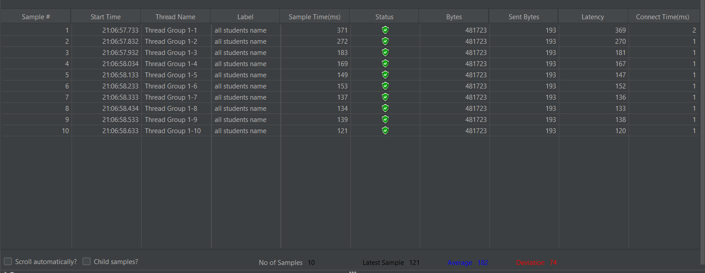
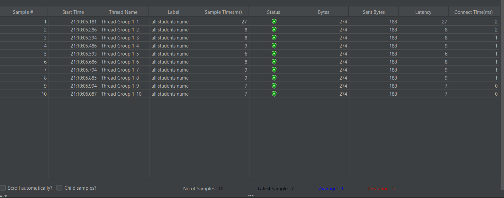

## RESULTS before profiling

\all-students

\all-student-name

\highest-gpa

## After Profiling

\all-students-name

\highest-gpa

There are improvements especially in average of sample time which before profiling it takes a lot of time
and after profiling it takes much more lower time and makes the program runs more faster and efficiently

## REFLECTION

1. What is the difference between performance testing with JMeter and profiling with IntelliJ Profiler?

answer: 
JMeter is external and symptomatic; it treats the app as a black box to measure response times and throughput from the user's perspective. IntelliJ Profiler is internal and diagnostic; it’s a white-box tool that looks inside the JVM to see exactly which methods or SQL queries are hogging CPU and memory.

2. How does the profiling process help you in identifying and understanding the weak points in your application?

It visualizes the "hot paths" via Flame Graphs and call trees. It strips away guesswork by showing exactly where execution time is spent—proving, for example, that the bottleneck isn't the logic itself, but a hidden N+1 database problem or excessive garbage collection

3. Do you think IntelliJ Profiler is effective in assisting you to analyze and identify bottlenecks in your application code?

Highly effective. The tight integration allows for an instant feedback loop between data and code. The Comparison View is particularly vital for university labs because it provides concrete, empirical proof that a refactor actually yielded the required performance gains.

4. What are the main challenges you face when conducting performance testing and profiling, and how do you overcome these challenges?

The biggest hurdle is environmental noise (background apps or JIT compiler lag). I overcome this by "warming up" the JVM with initial hits to the endpoint and ensuring a clean environment. I also use sampling profiling to avoid the "observer effect" where the tool itself slows down the app.

5. What are the main benefits you gain from using IntelliJ Profiler for profiling your application code?

Granular visibility. It distinguishes between CPU time (active processing) and Wait time (DB/Network lag). This helps identify "silent killers" like the $O(n^2)$ complexity of String concatenation that wouldn't be obvious just by looking at a browser loading screen.

6. How do you handle situations where the results from profiling are not entirely consistent with findings from JMeter?

This usually points to an infrastructure bottleneck rather than a code issue. If the profiler shows low CPU usage but JMeter shows high latency, I investigate external factors like database connection pool limits, network throttling, or PostgreSQL's own internal execution plan.

7. What strategies do you implement in optimizing code, and how do you ensure functionality remains unaffected?

I prioritize Complexity Reduction (e.g., $O(n^2)$ to $O(n)$), Join Fetching to minimize DB round-trips, and using StringBuilder for text manipulation. To ensure safety, I rely on Unit Testing; the optimized code must pass the same functional tests as the original slow version.

